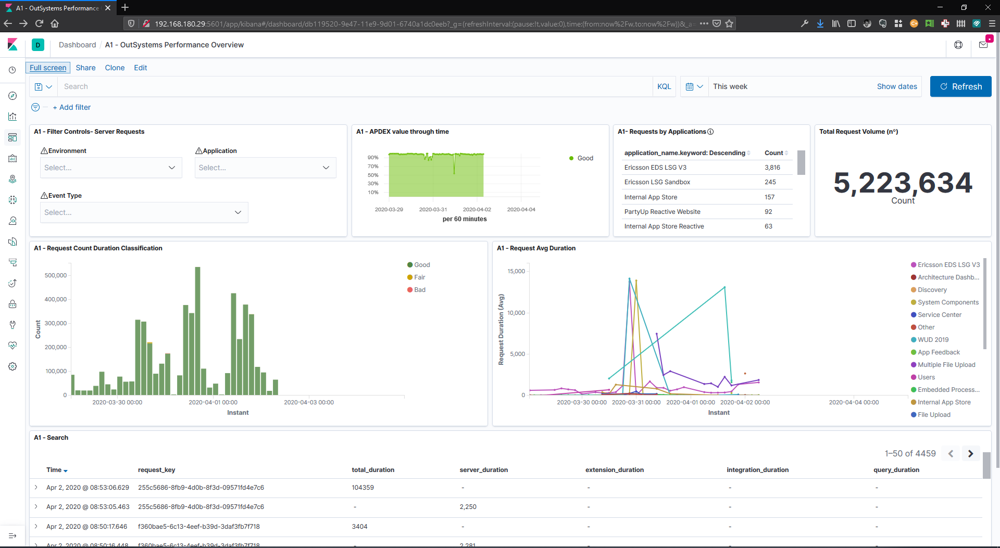

# outsystems-elastic-integration 🚀

**This project contains [Elastic](https://elastic.co/) accelerators to have greater and faster insights of the [OutSystems](https://www.outsystems.com/) monitoring data.**

**The accelerators 🎁 are:**
1. The **_Logstash_ code** to fetch data from the OutSystems Platform
2. The **_Kibana_ JSON visualizations definitions** to be able to easily observe applications and Plaform performance and errors

Deeper information of these accelerators are available at this [Wiki](https://github.com/OutSystems/outsystems-elastic-integration/wiki) repository. More specifically [here](https://github.com/OutSystems/outsystems-elastic-integration/wiki/Elastic-Accelerators-Information).

## Accelerators Goals 🎯
### High level perspective
- **Kibana Visualizations**
    - Understand OutSystems applications health (based on their performance)
    - Reduce time to insights (based in OutSystems monitoring data)
    - Improve troubleshooting capabilities

- **Logstash code**
    - Simplify monitoring data Extract, Transformation and Load (ETL)
    - Enrich data to allow build better visualzations

### More details
**Accelerate the ability of:**
1. Easily **observe the OutSystems monitoring data on Elastic with more advanced visualizations** that the ones available natively on the OutSystems administration tools;
2. Easily be able to search on OutSystems monitoring data, in particular on the OutSystems logs with:
    1. Free text search;
    2. Manipulation of the visible information. 
3. **Do more advance monitoring** that the ones available natively on the OutSystems administration tools. Like:
    1. Build an alerting system for an OutSystems environemnt or OutSystems Factory;
    2. Leverage Elastic analytics capabilities to have deeper insights of performance and behaviour of OutSystems Platform and applications;
    3. Etc.
3. **Be able to observe OutSystems applications and Platform _performance_ and _errors_ through time**;
    1. And quickly understand performance bottlenecks, areas to improve, etc.
    2. Be able to understand if performance is affected by:
        1. _Slow Queries_
        2. _Slow Integrations_
        3. _Slow Extensions_ 

### Examples of **_OutSystems_ monitoring metrics** possible to measure with this approach:
1. **Request Time Duration**
    And for each request:
    1. Client Time (load time)
    2. Server Time
    And on the server side:
        1. SAT (Session Acquisition Time)
        2. Query Execution Time
        3. Integration Execution Time
        2. Extension Execution Time
2. **Server side performance metrics**
    1. Session size
    2. Viewstate size
    3. Number of slow queries
    4. Number of slow integrations
    5. Number of slow extensions
3. **Errors metrics**
    1. Number of Errors
    2. Number of Errors by type 

*Important Notes*
- These metrics are the ones what *OutSystems Customer Success Experts* teams consider a starting point to understand applications and Platform performance; 
- As stated these are just examples of some of the metrics possible to monitor and/or calculate based on the *OutSystems* monitoring data on an Elastic instance. 

## How to contribute 📝
This code was created and is maintained by the *OutSystems Customer Success DevOps team* and **we are deeply interest on your contributions!**
So:
1. **Reach us** through:
    1. [OutSystems Community](https://www.outsystems.com/community/)
    2. Open an [issue](https://github.com/OutSystems/outsystems-elastic-integration/issues)
2. **Make a contribution directly here on GitHub!**
    1. Learn [how](https://kbroman.org/github_tutorial/pages/fork.html).

## License 📃
OutSystems distributes this project code under the Apache License with no support. We follow the same logic specified on the notice [file](https://github.com/OutSystems/outsystems-pipeline/blob/master/NOTICE.md).

## Change log
See the change log to learn about the latest changes and improvements to outsystems-pipeline.